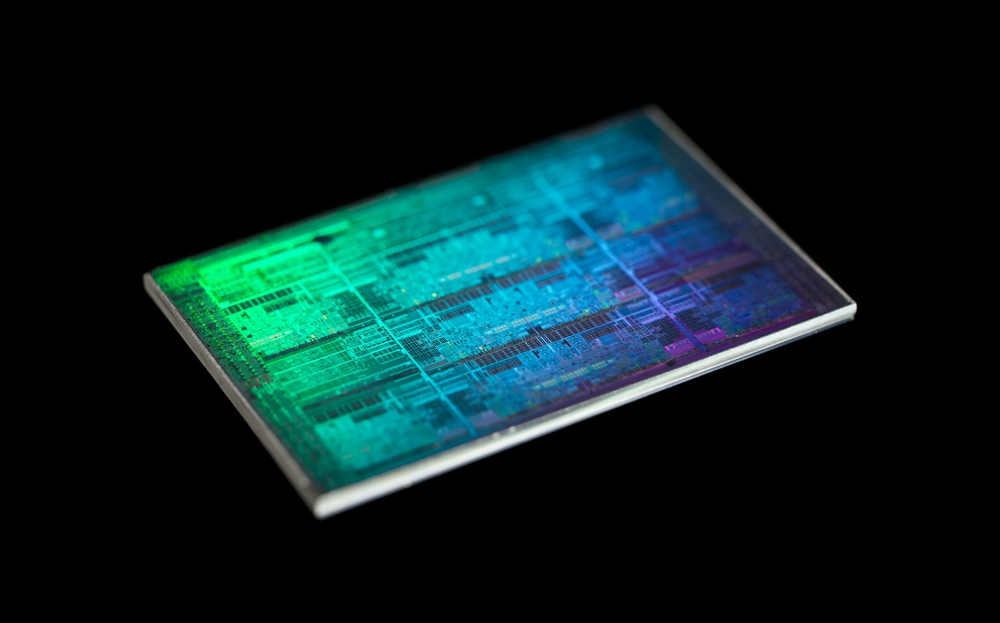
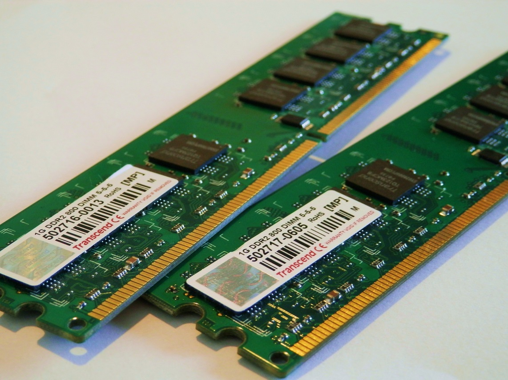
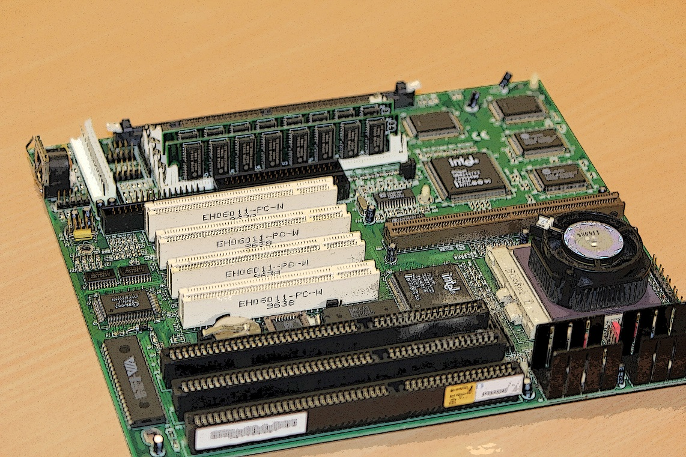
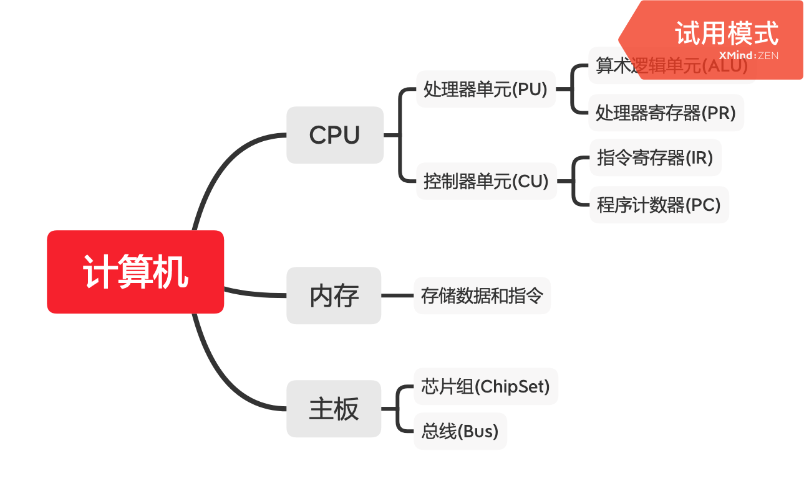

# 01 冯·诺依曼体系结构:计算机组成的金字塔

## 计算机硬件的基本组成

三大件:CPU、内存和主板

### 1. CPU(Central Processing Unit)

计算机中最重要的核心配件.全名中央处理器(Central Processing Unit).之所以说它重要,是因为计算机的所有"计算"工作,都是由CPU进行的.因此它最贵.

本质上,CPU就是个超级精细的印刷电路板.

### 2. 内存(Memory)

编写的程序、打开的浏览器、运行的游戏,都需要加载到内存里才能运行.程序读取的数据、计算的结果,也都要放在内存里.内存越大,能加载的东西就越多.

### 3. 主板(Motherboard)

主板是一个包含各种各样,甚至多达数十乃至上百个插槽的配件.CPU要插在主板上,内存也要插在主板上.主板的**芯片组(Chipset)**和**总线(Bus)**解决了CPU和内存之间如何通信的问题.**芯片组控制了数据传输的流向,也就是数据从哪到哪的问题.总线则负责实际传输数据.**因此,**总线速度(Bus Speed)决定了数据能传输多快.**

以上三大件,是组成一台计算机的必备硬件.因为有了这三样东西,计算机实际上就已经可以跑起来了,只是我们没办法从外部控制,也没办法看到它的计算结果.因此我们需要I/O设备.但实际上I/O设备是为了满足人的需求,而非是满足计算机的需求而存在的.

以下设备为一台计算机的非必须设备.

### 4. I/O设备

鼠标、键盘、硬盘、显示器、风扇等.

实际上这些东西并非必备.举个例子,网吧中的机器,都是没有硬盘的,是通过局域网和远程的网络硬盘交互的.云服务器,也没有键盘鼠标显示器这些设备,只要能通过网络,对外提供SSH远程登录访问即可.

### 5. 显卡(Graphics Card)

现在的主板基本上都内置了显卡.如果有特殊需求,需要配独显.显卡中有除了CPU之外的另一个处理器:GPU(Graphics Processing Unit,图形处理器)

### 6. 南桥(SouthBridge)芯片组

位于主板上的南桥芯片组用于给I/O设备提供和CPU通信的接口."南桥"这个名字很直观.一方面它在主板上的位置通常在主板的"南边",另一方面它的作用就是作为"桥",来连接鼠标、键盘、硬盘等外部设备和CPU之间的通信.

有南桥的话,自然有北桥.以前的主板上通常有北桥芯片,用于连接CPU和内存、显卡之间的通信.现在北桥芯片的工作已经被移都CPU的内部了

## 冯诺依曼体系结构

上文所述为一台计算机的硬件组成,那么手机也是这样的吗?

受限于手机尺寸的原因,手机制造商们选择把CPU、内存、网络通信甚至摄像头芯片都封装到一个芯片中,这种方式叫**SoC,即System on a Chip(系统芯片)**

那么,PC和手机的硬件组成方式是不同的.为什么我们写移动端和写PC上的程序时,没什么差别,都是通过"高级语言"这样的编程语言编写、编译后,一样是把代码和数据加载到内存中来执行,是什么抹平了这些差异呢?

答案是**冯·诺依曼体系结构(Von Neumann architecture)**.无论是PC、服务器、手机还是Raspberry Pi这种微型卡片机,都遵循着同一个"计算机"的抽象概念.这个抽象概念即为冯·诺依曼体系结构,也叫**存储程序计算机**

所谓存储程序计算机,包含了2个概念:

1. 可编程
2. 存储

### 1. 可编程

所谓的不可编程,可以想象这样一台计算机:

由各种门电路组合而成,然后通过组装出一个固定的电路板,来完成一个特定的计算程序.一旦需要修改功能,则需要重新组装电路.那么这样的计算机就是"不可编程"的.因为程序在计算机硬件层面"写死"了.比如说计算器.

### 2. 存储

存储指的是**程序本身是存储在计算机的内存(注意不是硬盘)里,可以通过加载不同程序来解决不同的问题.**

那么有存储式计算机,自然也有不能存储程序的计算机.比如"Plugboard"这样的插线板式的计算机.整个计算机就是一个巨大的插线板,通过在板子上不同的插头或接口的位置上插入线路,来实现不同的功能.这样的计算机是"可编程"的,但"不可存储".每次都需要重新插板子,也就是重新"编程".

## 计算机应该由哪些部分组成

**无论是"不可编程"还是"不可存储",都会让使用计算机的效率大大下降.这个对于效率的追求,就是"存储程序计算机"的由来.**

因此冯诺依曼写了一篇报告[First Draft of a Report on the EDVAC](https://zh.wikipedia.org/wiki/EDVAC%E5%A0%B1%E5%91%8A%E6%9B%B8%E7%9A%84%E7%AC%AC%E4%B8%80%E4%BB%BD%E8%8D%89%E6%A1%88)

**First Draft**里面说了一台计算机应该有哪些部分组成

### 1. CPU

### 1.1 处理器单元(Processing Unit)

**处理器单元(Processing Unit)**包含**算术逻辑单元(Arithmetic Logic Unit,ALU)**和**处理器寄存器(Processor Register)**.

作用:处理器单元用来完成各种算术和逻辑运算.由于它能够完成各种数据的处理或计算工作,因此也被叫做数据通路(Datapath)或运算器.

### 1.2 控制器单元(Control Unit)

**控制器单元(Control Unit)**包含**指令寄存器(Instruction Register)**和**程序计数器(Program Counter)**.

作用:控制程序的流程,也就是不同条件下的分支和跳转.

现代计算机中,上述的算逻运算单元和控制器单元共同组成了CPU.

### 2. 内存

用来存储数据(Data)和指令(Instruction).还有更大容量的外部存储,通常就是硬盘.

### 3. I/O设备及其对应的输入输出机制

个人电脑的鼠标键盘是输入设备,显示器是输出设备.我们用的智能手机,触摸屏既是输入设备,又是输出设备.而跑在各种云上的服务器,则是通过网络来进行输入和输出.这个时候,网卡既是输入设备又是输出设备

## 总结

任何一台计算机的任何一个部件,都可以归结到运算器、控制器、存储器输入设备和输出设备中.所有的现代计算机也都是基于这个基础架构来设计开发的.

所有的计算机程序,也都可以抽象为**从输入设备读取输入信息,通过运算器和控制器来执行存储在存储器中的程序,最终把结果输出到输出设备中.**而我们所编写的无论高级还是低级语言的程序,也都是基于这样一个抽象框架来运作的.

冯·诺依曼体系结构确立了我们现在每天使用的计算机硬件的基础架构.因此,学习计算机组成原理,其实就是学习和拆解冯·诺依曼体系结构.

具体来讲,学习组成原理,学的是控制器、运算器的工作原理,也就是CPU是如何工作的,以及CPU为何这么设计;学习内存的工作原理,学的是从电路到上层抽象再到CPU最后到应用程序的接口是怎样的;学习CPU是如何与I/O设备交互的

这个过程就是在理解从控制器、运算器、存储器、输入设备以及输出设备,从电路开始,到最终开放给软件的接口,是如何运作的,为何如此设计,以及在软件开发层面如何尽可能好的利用.

