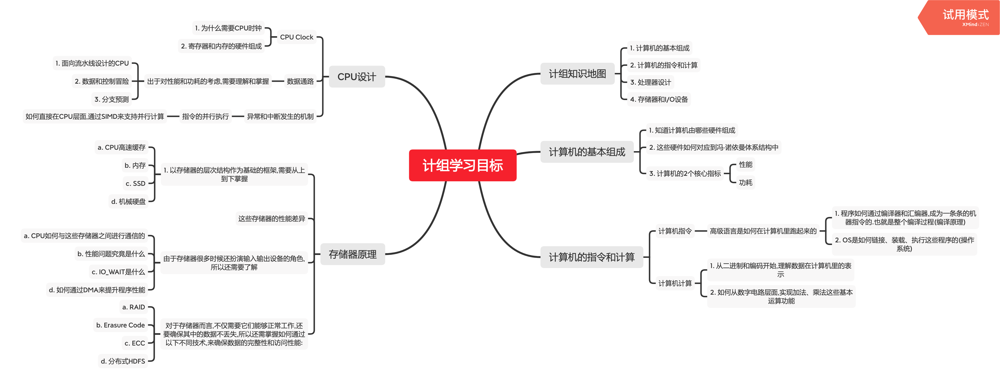

# 02 给你一张知识地图,计算机组成原理应该这么学

学习地图:

**整个计组,就是围绕着计算机是如何组织运作展开的**

## 1. 计组知识地图

整个计组拆分为4大部分:

1. 计算机的基本组成
2. 计算机的指令和计算
3. 处理器设计
4. 存储器和I/O设备

## 2. 计算机的基本组成

学习目标:

1. 知道计算机由哪些硬件组成
2. 这些硬件如何对应到冯·诺依曼体系结构中
3. 计算机的2个核心指标 

	a. 性能
	
	b. 功耗
	
硬件即:运算器、控制器、存储器、输入设备、输出设备

## 3. 计算机的指令和计算

### 3.1 计算机指令

学习目标:

1. 高级语言是如何在计算机里跑起来的 

	a. 程序如何通过编译器和汇编器,成为一条条的机器指令的.也就是整个编译过程(编译原理)
	
	b. OS是如何链接、装载、执行这些程序的(操作系统)
	
**这一条条指令执行的控制过程,就是由控制器来控制的**

### 3.2 计算机计算

学习目标:

1. 从二进制和编码开始,理解数据在计算机里的表示
2. 如何从数字电路层面,实现加法、乘法这些基本运算功能

**这些运算功能由ALU(Arithmetic Logic Unit,算术逻辑单元)来实现**

这里有一个非常重要的知识点:浮点数.掌握浮点数能够对数据的编码、存储和计算有一个深入的理解

## 4. CPU设计

### 4.1 CPU时钟(CPU Clock)

CPU时钟用来构造寄存器和内存的锁存器和触发器.因此CPU时钟是学习CPU的前导知识

学习目标:

1. 为什么需要CPU时钟
2. 寄存器和内存的硬件组成

### 4.2 数据通路

数据通路连接了运算器和控制器,并最终组成了CPU

学习目标:

1. 出于对性能和功耗的考虑,需要理解和掌握: 

	a. 面向流水线设计的CPU
	
	b. 数据和控制冒险
	
	c. 分支预测
	
### 4.3 异常和中断发生的机制

学习目标:

1. 指令的并行执行. 

	如何直接在CPU层面,通过SIMD来支持并行计算
	
## 5. 存储器的原理

学习目标:

1. 以存储器的层次结构作为基础的框架,需要从上到下掌握:

	a. CPU高速缓存
	
	b. 内存
	
	c. SSD硬盘
	
	d. 机械硬盘
	
	的工作原理.

2. 它们之间的性能差异 

由于存储器很多时候还扮演输入输出设备的角色,所以还需要了解:
	
1. CPU如何与这些存储器之间进行通信的
2. 性能问题究竟是什么
3. IO_WAIT是什么
4. 如何通过DMA来提升程序性能

对于存储器而言,不仅需要它们能够正常工作,还要确保其中的数据不丢失,所以还需掌握如何通过以下不同技术,来确保数据的完整性和访问性能:

1. RAID
2. Erasure(n. 消除,消磁) Code
3. ECC
4. 分布式HDFS

## 6. 学习计组的好办法

这门课是整个计算机学科里的"纲要",这门课中的任何一个知识点,深挖下去都是计算机科学里的一门核心课程.

因此,我们需要3个学习方法.

### 6.1 学会提问自己来串联知识点

学完一个知识点之后,从以下2个方面,对自己提问:

1. 我写的程序,怎样从输入的代码,变成运行的程序,并得到最终结果的?
2. 整个过程中,计算器层面经历了哪些步骤?有哪些地方是可以优化的?

### 6.2 写一些示例程序来验证知识点

计组中大量的原理和设计,都对应着"性能"这个词.因此,把对应的知识点变成一个个性能对比的示例代码记录下来,远强于死记硬背.

### 6.3 通过计算机硬件发展的历史做对照

通过了解计算机硬件发展史,可以更容易理解计组中各种原理的由来

## 7. 学习资料和入门书籍

### 7.1 入门资料

1. 《计算机是怎样跑起来的》
2. 《程序是怎样跑起来的》
3. [北大公开课:Computer Organization](https://www.coursera.org/learn/jisuanji-zucheng)

### 7.2 深入资料

1. 《计算机组成与设计:硬件/软件接口》
2. 《深入理解计算机系统》
3. [配套视频课程](https://www.bilibili.com/video/av24540152/)
4. 《计算机组成：结构化方法》(辅助参考书)
5. 《计算机体系结构：量化研究方法》

