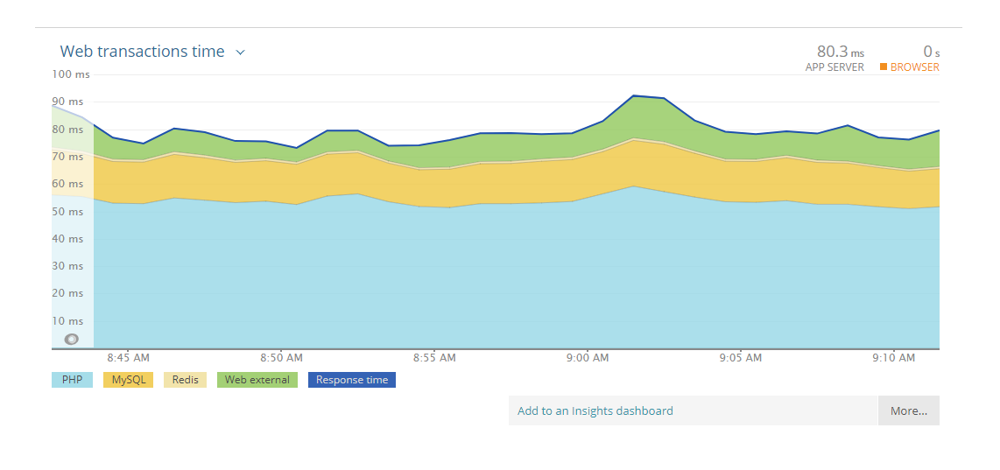
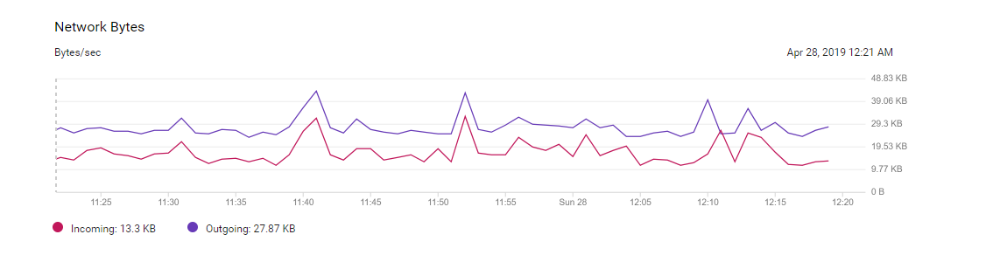

# 03 通过你的CPU主频,我们来谈谈"性能"究竟是什么?

**学习计组,就是理解计算机是如何运作的,以及为什么要这么运作."为什么"所要解决的问题,很多时候就是提升"性能".**

## 1. 什么是性能?--时间的倒数

衡量计算机性能的标准:

1. 响应时间(Response time),又叫执行时间(Execution time)
2. 吞吐率(Throughput),又叫带宽(Bandwidth)

### 1.1 响应时间



可以理解为让计算机"跑得更快".也就是执行一个程序要花费的时间.要花费的时间越少,自然性能也就越好.

### 1.2 吞吐率



可以理解为让计算机"搬的更多".也就是在一定的时间范围内,嫩处理的数据量或执行的程序指令的数量.

### 1.3 提升性能的方法

通常来讲,缩短程序响应时间,一般来讲都会提升吞吐率.

除了缩短响应时间外,还可以使用多核CPU同时处理数据.这样在单位时间内可以处理更多的数据,吞吐率自然就上去了.

提升吞吐率的的办法很多,通常多加一些机器,多堆一些硬件,吞吐就上去了.但是提升响应时间就比较难了,因为CPU的性能提升在10年前就处于"挤牙膏"的状态了.

通常我们把性能定义成时间的倒数,即:**性能 = 1 / 响应时间**

## 2. 计算机的计时单位:CPU时钟

### 2.1 用时间衡量性能,存在的问题

#### a. 时间不准

如果用你自己随便写的一个程序,来统计程序运行的时间,每一次统计结果不会完全一样.有可能这一次花了45ms,下一次变成了53ms.

为什么?

我们统计时间类似于"掐秒表",用程序运行结束的时间减去程序开始运行的时间.这个时间也叫做Wall Clock Time或者Elapsed Time.也就是**程序运行期间,挂在墙上的钟走掉的时间.**

但是,计算机中同时运行着好多个程序,CPU实际上不停地在各个程序之间进行切换.在这些走掉的时间中,CPU很可能切换去运行别的程序了.而且有些程序在运行时,可能要从网络、硬盘中去读取数据,这段时间要等待网络和硬盘把数据给读出来,给到内存和CPU.这段时间不是程序的运行时间.所以说,**要想准确统计程序的运行时间,进而比较2个程序的实际性能,我们需要把这些时间给扣除出去.**

以下是一个Linux下,单核统计打印100W次所需Wall Clock Time的实验.

```
[root@web01 ~]# time seq 1000000 | wc -l
1000000

real	0m0.022s
user	0m0.018s
sys		0m0.003s
```

1. real time 

	也就是Wall Clock Time.即程序运行过程中消耗的时间

2. user time 

	CPU在运行你的程序时,处于用户态运行指令所消耗的时间

3. sys 

	CPU在运行你的程序时,处于OS内核里运行指令所消耗的时间

**程序实际消耗的CPU执行时间(CPU Time),即为user time + sys time**


在这个例子中,我们可以看到,Wall Clock Time为0.022ms,但user time + sys time是小于Wall Clock Time的.这就说明在Wall Clock Time期间内,有一段时间CPU是去处理其他程序了.

#### b. 就算拿到了CPU Time,也不一定能能直接"比较"出2个程序的性能差异

即使在同一台计算机上,CPU可能满载运行,也可能降频运行,那么降频运行时所消耗的时间自然比满载时要多.

## 3. 拆解"时间"

除了CPU之外,时间这个性能指标还会受到主板、内存这些其他相关硬件的影响.所以,我们需要对"时间"这个我们可以感知的指标进行拆解.

上文已经说过,**CPU Time = user time + sys time**.即:**CPU处于用户态运行指令的耗时 + CPU处于内核态运行指令的耗时**这是从软件的角度看待CPU Time.那么从硬件的角度上看CPU Time,可以拆解为:

1. CPU时钟周期数(CPU Cycles)
2. 时钟周期时间(Clock Cycle Time)

**程序的CPU执行时间 = CPU时钟周期数 * 时钟周期时间**.(即:总耗时 = 晶振次数 * 晶振1次所需时间)

### 3.1 时钟周期时间

先来看CPU的主频.比如`Intel(R) Core(TM) i7-7820HQ CPU @ 2.90GHz`,可以粗浅地认为CPU能够在1秒内执行简单指令的数量为2.9G条.

更准确描述的话,这个2.90GHz就代表,CPU的"钟表"所能识别的最小时间间隔.就比如人类用的钟表,能识别的最小时间间隔为1s.而CPU内部,和电子石英表类似,有一个叫晶体振荡器(Oscillator Crystal)的东西,简称叫晶振.我们把晶振当成CPU内部的电子表来使用.晶振的每一次"滴答",即为时钟周期时间.可以认为时钟周期时间就是晶振1次所需的时间.

在我这个2.90GHz的CPU上,时钟周期时间即为1/2.9G.CPU就是按照这个"时钟"提示的时间来进行自己的操作.主频越高,这个"时钟"走的就越快(比如2.1GHz,则这个表每1/2.1G走一次,即CPU1/2.1G操作1次;3.1GHz,则这个表1/3.1G走一次,即CPU1/3.1G操作1次),CPU也就"被逼"着走的越快.

所谓超频,其实就相当于把买回来的CPU内部的钟给调快了,于是 CPU 的计算跟着这个时钟的节奏,也就自然变快了.当然这个快不是没有代价的,CPU跑得越快,散热的压力也就越大.就和人一样,超过生理极限,CPU就会崩溃了.

### 3.2 分解时钟周期数

再回到这个公式:

**程序的CPU执行时间 = CPU时钟周期数 * 时钟周期时间**

那么提升性能的方案之一,就是减小Clock Cycle的值,换句话说就是换个牛逼的CPU.这个和写代码没啥关系.那么我们能做的就是减小CPU Cycles的值.

CPU时钟周期数(CPU Cycles) = **指令数量 * 每条指令的平均时钟周期数**(Cycles Per Instruction,简称CPI)

这里要解释的是CPI.不同的指令需要的Cycles是不同的(也就是说不同的指令执行完毕所需的晶振次数是不同的.)加法和乘法都对应着1条CPU指令,但乘法所需的Cycles就比加法要多,自然也就比加法慢.所以此处计算CPU时钟周期数,需要取平均值.

举个例子,某程序编译后共12条CPU指令,但这些指令的CPI为1.5,即平均每条指令所需时钟周期数为1.5次,则这个程序所需的CPU时钟周期数(也就是该程序执行完毕总共所需的晶振次数) = 12 * 1.5 = 18次.

## 4. 解决性能问题,优化的究竟是什么?

那么公式**程序的CPU执行时间 = CPU时钟周期数 * 时钟周期时间**经过3.2小节的拆解,就变为了:

**程序的CPU执行时间 = 指令数量 * CPI * Clock Cycle Time**

所以我们优化的实际上也就是这三者.

### 4.1 时钟周期时间(Clock Cycle Time)的优化

时钟周期时间,就是计算机主频,这个取决于计算机硬件.[摩尔定律](https://zh.wikipedia.org/wiki/%E6%91%A9%E5%B0%94%E5%AE%9A%E5%BE%8B)一直在提高计算机的主频.

### 4.2 每条指令的平均时钟周期数(CPI)

即一条指令到底需要多少CPU Cycle.后续学习CPU结构时,会看到线代CPU通过流水线技术(Pipeline),让一条指令所需的CPU Cycle尽可能的少.因此,对于CPI的优化,也是计算机组成和体系结构的重要一环.

### 4.3 指令数

表示执行我们的程序时,到底需要哪些指令、需要多少条指令.这个时候就是把挑战交给编译器了.同样的代码,编译成计算机指令时,有不同的表示方式.

## 5. 关键概念总结

### 5.1 3个公式

1. 程序的CPU执行时间 = CPU Cycles * Clock Clyle Time
2. CPU Cycles = 指令数量 * CPI
2. 程序的CPU执行时间 = 指令数量 * CPI * Clock Cycle Time

### 5.2 CPU Cycles

CPU时钟周期数.也就是CPU跑完一段程序,所需的晶振次数.

### 5.3 Clock Cycle Time

时钟周期时间.即1/主频.表示晶振1次所需的时间.

### 5.3 CPI

对于一段指令中,执行这些指令时平均每条指令所需的晶振次数.

## 6. 补充说明

对于本文中的实验,如果使用多核CPU,会出现以下情况:

```
time seq 1000000 | wc -l
1000000

real	0m0.021s
user	0m0.019s
sys		0m0.004s
```

即Wall Clock Time < user time + sys time.这是因为"并行"运行的缘故.虽然seq和wc这2个命令都是单线程的,但这2个命令在多核的情况下,分别分配到2个不同的CPU上了,但计算user time和sys time的时间时,是将2个cpu上运行的时间加在一起的.所以超过了real time.

```
time seq 1000000000 | wc -l &
[1] 2125
top
top - 14:12:29 up 2 min,  2 users,  load average: 0.36, 0.11, 0.04
Tasks: 128 total,   3 running, 125 sleeping,   0 stopped,   0 zombie
%Cpu(s): 22.5 us,  7.2 sy,  0.0 ni, 70.0 id,  0.0 wa,  0.0 hi,  0.2 si,  0.0 st
KiB Mem :   995712 total,   774544 free,   116924 used,   104244 buff/cache
KiB Swap:  1048572 total,  1048572 free,        0 used.   751372 avail Mem 

   PID USER      PR  NI    VIRT    RES    SHR S  %CPU %MEM     TIME+ COMMAND                                                                                                                                                                                                   
  2126 root      20   0  108072    616    520 R  68.8  0.1   0:05.34 seq                                                                                                                                                                                                       
  2127 root      20   0  108276    672    572 R  50.2  0.1   0:03.90 wc 
```

可以看到,seq命令和wc命令时分别在2个不同的CPU上跑的.


