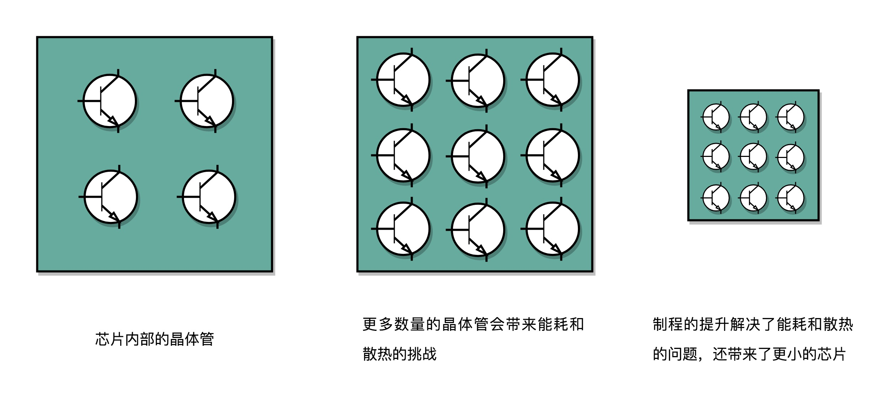

# 04|穿越功耗墙,我们该从哪些方面提升"性能"?

上节课中,我们在讲CPU性能时,提到了这样一个公式:

程序的CPU执行时间 = 指令数量 * CPI * Clock Cycle Time

即:

程序的CPU执行时间 = 指令数量 * 平均每条指令所需的晶振次数 * 每次晶振所需的时间

那么从这个公式来看,想要提升计算机性能,可以从指令数量、CPI和主频这3个方向下手.要提升指令数量或者CPI,这都是软件方面的问题.于是研发CPU的硬件工程师们,从上世纪80年代开始,就开始研究主频.在CPU上多放一些晶体管,不断提升CPU的时钟频率(也就是Clock Cycle Time),这样CPU就能变快,程序执行时间就会缩短.

于是,从1978年Intel发布的8086CPU开始,计算机主频从5MHz开始,不断提升.1980年中期的80386能够跑到40MHz,1989年的486能够跑到100MHz,直到2000年的奔腾4处理器,主频已经到达了1.4GHz.消费者也在这20年里,养成了"看主频买电脑"的习惯.当时基本已经垄断了桌面CPU时长的Intel更是表示奔腾4所使用的CPU结构可以做到10GHz,像是"大力出奇迹"一样.

## 1. 功耗:CPU的"人体极限"

然而计算机科学从来没有"大力出奇迹".奔腾4的CPU主频也从来没有打到过10GHz.最终它的主频上限定格在了3.8GHz.更糟糕的是,大家发现奔腾4的主频虽然高,但是它的实际性能与主频并不匹配.用在笔记本上的奔腾4 2.4GHz处理器,其性能和基于奔腾3架构的奔腾M1.6GHz处理器是差不多的.

这一次"大力出杯具",不仅让AMD获得了喘息之机,更代表着"主频时代"的终结.后边几代Intel CPU主频不仅没有上升,反而下降了.到如今,2019年最高配置的Intel i9 CPU,主频也只有5GHz.**相较于1978年到2000年,这20年里300倍的主频提升(5MHz-1.4GHz),从2000年到2019年,CPU的主频大概提高了3倍.**

那么,为什么奔腾4的主频没能超过3.8GHz呢?答案就是功耗问题.那么什么是功耗问题呢?先来看一个例子.

一个3.8GHz的奔腾4处理器,满载功率为130瓦(W:即焦耳/秒,表示每秒所需的能量,在电学制单位中,即V*A 注:V:J/C C:库伦 即电荷数量;I:Q/t Q:时间t内通过导线横截面的电量,即库伦. t:时间).

那么这130瓦是什么概念呢?机场允许带上飞机的充电宝容量上限为100瓦时(能量单位,表示1小时可输出多少能量).那么把这个CPU装到手机上,不考虑其他元件的耗电,这个CPU满载运行45分钟不到,充电宝就没电了.而iPhone X使用ARM架构的CPU,功率则只有4.5瓦左右.

我们的CPU,一般都被叫做**超大规模集成电路(Very-Large-Scale Integration,VLSI).**这些电路实际上都是由一个个晶体管组合而成的.CPU的计算,其实就是让晶体管里的"开关"不断地去"打开"和"关闭"(实际上就是调整每个晶体管的电压,二项变化),来组合完成各种运算和功能.

那么想要计算的快,就有2个方向:

1. 增加密度.也就是在CPU中,同样面积下,多放一些晶体管
2. 提升主频.也就是让晶体管"打开"和"关闭"的更快一点

这2个方向,都会增加功耗(晶体管多了,J就上去了;频率高了,s就下来了,所以无论如何,瓦都会增大),带来耗电和散热的问题.

多放晶体管的前提:CPU面积不能变大.CPU面积变大,就意味着电信号传输的时间会变长,那么运算速度自然就慢了.

提升主频带来的问题:散热.之所以会在CPU上抹硅脂、装风扇、装水冷,其实就是为了在同样空间下,提升散热效果.但同样的,散热效果的提升也是有极限的.

那么在CPU里,晶体管数量和主频都是有极限的.一个CPU的功率,可以使用如下公式表示:

功耗 ≈ 1/2 * 负载电容 * 电压^2 * 开关频率 * 晶体管数量

那么想要提升性能,就要增加晶体管数量.同样面积下想要多放一些晶体管,那就只能是把晶体管制造的小一点.即**制程**.从28nm到7nm,晶体管本身变成了原来的1/4大小.

同时还要提升主频,也就是让晶体管开关的频率变快.

那么根据上述公式,开关频率和晶体管数量都上升,必然导致功耗的上升.那么此时就需要降低电压.在公式中,功耗和电压的平方是呈正比的.这就意味着降低电压会很有效的减小功耗.

实际上,从5MHz主频的8086到5GHz的Intel i9,电压已经从5V左右下降到了1V左右.这也就是为什么CPU的主频提升了1000倍,但功耗只提升了40倍的原因.

## 2. 并行优化,理解阿木达尔定律

制程的优化和电压的下降,在过去20年里,让CPU性能不断提升.从上世纪90年代到本世纪初,软件工程师使用的"面向摩尔定律编程"的套路失灵了."写程序不考虑性能,等明年CPU性能提升一倍,到时候性能自然就不成问题了",这种想法已经行不通了.

于是,从奔腾4开始,Intel意识到通过提升主频比较"难"实现性能提升,就开始从"吞吐率"而非"响应时间"上想办法,推出了Core Duo这样的多核CPU.不管你有没有需要(因为你的任务不一定能够并行解决),这样做CPU的性能就是提升了2倍、4倍甚至8倍.

举个例子.做机器学习时,需要计算向量的点积,比如:向量W=[W0​, W1​ , W2​, …, W15​]和向量X=[X0​, X1​, X2​, …, X15​]做点积运算,则有:

W · X=W0 * X0​ + W1​ * X1​ + W2​ * X2​ + … + W15​ * X15​

这个式子由16个乘法和一个累加组成.如果1个人算,则需要做16次乘法和15次加法.那么如果把任务分配给4个人,同时计算W0 ~ W3,W4~W7,W8~W11,W12~W15这4个部分的结果,再由1个人进行汇总,需要的时间就会减少.

但是并不是所有问题都能够通过并行来提高性能.如果想要并行,需要满足以下几个条件:

1. 需要进行的计算,本身可以分解成几个并行的任务且分解后不影响最终结果. 

2. 需要能够分解好问题,并确保结果最终能够汇总在一起 

3. 在汇总阶段,无法并行,只能由1个人按顺序执行,一步一步来.

这就引出了在性能优化中,常常用到的一个经验定律,阿姆达尔定律(Amdahl's Law),该定律描述了对一个程序进行优化后,处理器并行运算后效率的提升情况,用一个公式表示为:

优化后的执行时间 = 受优化影响的执行时间 / 加速倍数 + 不受优化影响的执行时间

在刚刚向量点积的例子中,4个核同时计算向量的一小部分点积,就是并行提高了这部分的计算性能,也就是公式中**受优化影响的执行时间**.但是这4个核的计算结果,最终还是要在1个核中进行汇总相加.而这部分汇总相加的时间,无法通过并行优化,也就是公式中**不受优化影响的执行时间**.

比如各个向量的一小段点积运算(也就是乘法)需要100ns,加法需要20ns,则共需120ns.此时有4个CPU进行并行计算,则优化后,即为100 / 4 + 20 = 45ns;即使增加更多的并行度来提供加速倍数,假设有100个CPU,则整体时间也需要100 / 100 + 21 = 21ns.

## 3. 总结延伸

可以看到,无论是提升主频还是堆叠CPU核心数量,通过并行来提升性能,也会遇到瓶颈.所以"堆硬件"已经不能很好地满足人们对性能的期望了.所以工程师们需要从其他方面下功夫了.

在"摩尔定律"和"并行计算"外,在整个计算机组成层面,还有这样几个原则性的性能提升方法:

1. 加速大概率事件 

	最典型的就是,过去几年流行的深度学习,整个计算过程中,99%都是向量和矩阵计算.于是,工程师们通过用GPU替代CPU,大幅度提升了深度学习的模型训练过程.本来一个CPU需要跑几小时甚至几天的程序,GPU只需要几分钟就好了.Google更是不满足于GPU的性能,进一步地推出了TPU.后面的文章,我也会为你讲解GPU和TPU的基本构造和原理.
	
2. 通过流水线提高性能 

	现代的工厂里的生产线叫"流水线".我们可以把装配iPhone这样的任务拆分成一个个细分的任务,让每个人都只需要处理一道工序,最大化整个工厂的生产效率.**类似的,我们的CPU其实就是一个"运算工厂".我们把CPU指令执行的过程进行拆分,细化运行,也是现代CPU在主频没有办法提升那么多的情况下,性能仍然可以得到提升的重要原因之一.**我们在后面也会讲到,现代CPU里是如何通过流水线来提升性能的,以及反面的过长的流水线会带来什么新的功耗和效率上的负面影响.
	
3. 通过预测提高性能

	通过预先猜测下一步该干什么,而不是等上一步运行的结果,提前进行运算,也是让程序跑得更快一点的办法.典型的例子就是在一个循环访问数组的时候,凭经验,你也会猜到下一步我们会访问数组的下一项.后面要讲的"分支和冒险"、"局部性原理"这些CPU和存储系统设计方法,其实都是在利用我们对于未来的"预测",提前进行相应的操作,来提升我们的程序性能.
	
## 4. 补充阅读

1. 《计算机组成与设计:软/硬件接口》(第5版)的1.7和1.10节,也简单介绍了功耗墙和阿姆达尔定律

2. 如果你想对阿姆达尔定律有个更细致的了解,《深入理解计算机系统》(第3版)的1.9节

## 5. 其他疑问

Q: 程序运行CPU执行时间 = 指令数量 * CPI * Clock Cycle Time这个公式和晶体管数量的关系是什么?增加晶体管数量影响了这个公式中的哪一部分?

增加晶体管数量,其实就是通过提供更复杂的电路来支持更多的"指令".即减少了运行同样程序所需的指令数.

举例:最简单的电路只有加法功能没有乘法功能,.乘法都变成了很多个加法指令.那么实现一个乘法所需的指令数就比较多.但是如果增加晶体管在电路层面就实现了乘法指令,那么所需的指令数就变少了,执行时间也就缩短了.