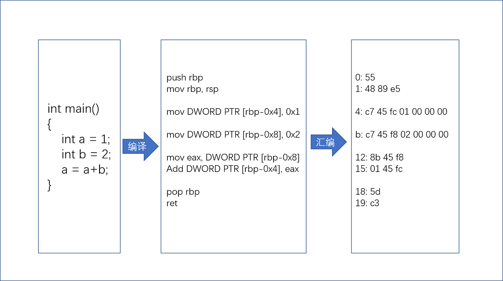
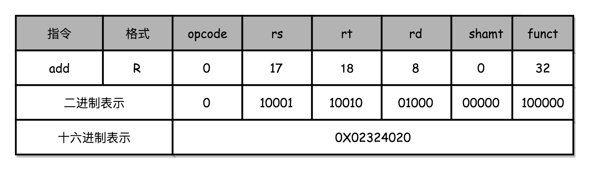

# 05|计算机指令:让我们试试用纸带编程

以前写程序时,要用到一种古老的物理设备:打孔卡(Punched Card).使用这种设备写程序,要先在脑海里或者纸上写出程序,然后再纸带或卡片上打洞.这样,要写的程序、要处理的数据,就变成一条条纸带或者一张张卡片,之后再交给当时的计算机去处理.


那时候人们在特定的位置上打洞或不打洞,来代表0或者1.

为什么早起的计算机程序要使用打孔卡,而不能像现在这样用高级语言来写呢?因为那时候的CPU没有能力理解高级语言.即使在现在,我们使用的PC,仍然只能处理"机器码",也就是一连串的0和1.

那么高级语言最终如何变成一串0和1的?这一串0和1在CPU中又是如何被处理的?这就需要了解"机器码"和"计算机指令"了.

## 1. 在软硬件接口中,CPU帮我们做了什么事?

从**硬件**的角度来看,CPU就是一个超大规模集成电路,通过电路实现了加法、乘法乃至各种各样的处理逻辑.

从**软件**角度来看,CPU是一个执行各种**计算机指令(Instruction Code)的逻辑机器.**这里说的计算机指令,就是一门CPU能够听懂的语言,可以把它叫做**机器语言(Machine Language)**不同架构的CPU所使用的**计算机指令集(Instruction Set)**是不同的.比如PC使用的是Intel的CPU,手机使用的是ARM的CPU,则在电脑上写的程序,复制到手机上,就是跑不起来的.但是复制到另一台电脑上,就是可以的.

一个计算机程序,是由成千上万条指令组成的.但是CPU里不可能存放着所有指令,所以计算机程序平时是存储在存储器中的.**这种程序指令存储在存储器中的计算机,叫做存储程序型计算机(Stored-program Computer)**

## 2. 从编译到汇编,代码怎么变成机器码?

现有一段c语言代码如下:

```c
int main() {
    int a = 1;
    int b = 2;
    a = a + b;
}
```

这段程序想要在Linux下跑起来,需要2个过程:

1. 高级语言编译(Compile)成汇编语言(ASM,Assembly Language) 
2. 汇编代码使用汇编器(Assembler)翻译为机器码(Machine Code)

**机器码就是由0和1组成的机器语言来表示的.这一条条机器码,就是一条条的计算机指令.**

程序 -[编译器(Complier)]-> ASM汇编语言 -[汇编器(Assembler)] -> 机器码

打印对应的汇编代码和机器码

```
gcc -g -c test.c 
objdump -d -M intel -S test.o
```

注:

1. gcc命令及参数含义 

	gcc:一开始只是C语言的编译器(GNU C Compiler,GCC),后来扩展为能够在各类处理器架构上编译C++、GO、JAVA等多种语言,改名为GNU编译器套件(GNU Compiler Collection).
	
	-g:生成调试信息
	
	-c:编译、汇编到目标代码(也就是计算机可识别的二进制)

2. objdump命令及参数含义 

	objdump:Linux下反汇编目标文件或可执行文件的命令
	
	-d:从目标文件中反汇编那些特定指令机器码的section
	
	-M:指定反汇编目标文件时使用的架构
	
	-S:尽可能反汇编出源代码,尤其当编译的时候指定了-g这种调试参数时,效果比较明显
	
编译结果:

```
test.o：     文件格式 elf64-x86-64


Disassembly of section .text:

0000000000000000 <main>:
int main() {
   0:	55                   	push   rbp
   1:	48 89 e5             	mov    rbp,rsp
    int a = 1;
   4:	c7 45 fc 01 00 00 00 	mov    DWORD PTR [rbp-0x4],0x1
    int b = 2;
   b:	c7 45 f8 02 00 00 00 	mov    DWORD PTR [rbp-0x8],0x2
    a = a + b;
  12:	8b 45 f8             	mov    eax,DWORD PTR [rbp-0x8]
  15:	01 45 fc             	add    DWORD PTR [rbp-0x4],eax
}
  18:	5d                   	pop    rbp
  19:	c3                   	ret  
```

左侧的数字(55、48、89、e5等)为机器码;右边的push、mov、add、pop等为机器码对应的汇编代码.**汇编代码和机器码之间是一一对应的**

既然GCC可以直接把源代码编译成机器码(计算机指令),为什么还需要汇编代码呢?因为汇编代码是"给程序员看的机器码".汇编代码比机器码对于人类来讲便于记忆.



**从高级语言编译为汇编语言,再由汇编语言编译为机器码,就是一个日常开发程序,最终编程CPU可执行的计算机指令的过程.**

## 2. 解析指令和机器码

### 2.1 指令

所谓指令,其实就是汇编语言.

Intel CPU,有2000条左右的CPU指令.将它们分成5大类:

1. 算数类指令

	加减乘除在CPU层面,都会变成一条条算数类指令
	
2. 数据传输类指令

	给变量赋值、在内存中读写数据,用的都是数据传输类指令
	
3. 逻辑类指令

	逻辑的与或非,都是这一类指令
	
4. 条件分支类指令

	if/else语句,都是条件分支类指令
	
5. 无条件跳转指令

	在调用函数时,就是发起一个无条件跳转指令
	
| 指令类型 | 示例指令 | 示例汇编代码 | 含义 | 注释 |
| ------ | ------ | ------ |------ |------ |
| 算数类指令 | add | add $s1, $s2, $s3 | $s1 = $s2 + $s3 | 将s2和s3寄存器中的数相加后的结果放到寄存器s1中 |
| 逻辑类指令 | or | or $s1, $s2, $s3 | `$s1 = $s2 | $s3` | 将s2和s3寄存器中的数按位取活后的结果放到寄存器s1中 |
| 数据传输类指令 | load word | load $s1, 10($s2) | $s1 = memory[$s2 + 10] | 取s2寄存器中的数,加上10偏移量后,找到内存中的字,存入到s1寄存器中 |
| 条件分支指令 | branch on equal | beq $s1, $s2, 10 | if($s1 == $s2) go to PC + 4 + 10 | 如果s1和s2寄存器内的值相等,从程序计数器往后跳10 |
| 无条件跳转指令 | jump | j 1000 | go to 1000 | 跳转到1000这个目标地址 |

### 2.2 机器码

不同的CPU有不同的指令集,也就对应着不同的汇编语言和不同的机器码.此处选用最简单的MIPS指令集,来看看机器码是如何生成的.

**MIPS的指令是一个32位的整数,高6位为操作码(opcode),表示了这条指令具体是一条什么样的指令,剩下26位有3种格式,分别是R、I和J.**


其中rs表示第1个寄存器的地址;rt表示第2个寄存器的地址;rd表示目标的临时寄存器地址

1. R指令

	R指令一般用来做算术和逻辑操作,里面有读取和写入数据的寄存器地址.若为逻辑位移操作,则后边还有位移操作的位移量(shamt).最后的功能码(funct),则是在前面的操作码不够的时候,扩展操作码所表示的对应指令的.(对应算术类和逻辑类指令)
	
2. I指令

	通常用在数据传输、条件分支,以及在运算的时候使用的并非变量还是常数的时候.(TODO:怀疑这句话是作者笔误)此时没有位移量和功能码,也没有第3个寄存器,而是把这3部分直接合并成了1个地址值或者1个常数.
	
3. J指令

	跳转指令.高6位之外的26位都表示1个跳转后的地址.
	
## 3. 举例说明与打孔

### 3.1 举例说明 

以加法算术指令`add $t0, $s2, $s1`为例解释.

为方便表示,先用10进制来表示.



1. opcode

	加法对应的MIPS指令里的opcode为0

2. rs

	第1个寄存器s1的地址的地址为17
	
3. rt

	第2个寄存器s2的地址为18
	
4. rd

	临时寄存器t0的地址为8
	
5. shamt

	由于不是位移操作,所以是0
	
6. funct

	功能码为32
	
综上所述,其2进制表示为:

000000 10001 10010 01000 00000 100000

转换为16进制为(注意2进制转16进制时,每4位分割1次):

0x2324020

### 3.2 打孔

此处假设机器从左往右,按列来读取卡片.白色表示没有打孔,黑色表示打孔了.卡片有8列,每一列代表1个数字.卡片共4行,从上往下表示从高位到低位.

则:0x2324020的打孔卡为:


## 4. 总结延伸

打孔卡其实就是一种存储程序型计算机.只不过打孔卡所记录的程序,其机器码不是通过计算机编译出来的,而是由程序员人肉编译的.而且程序也没有存储在存储器中,而是存储成了一张打好孔的卡片.

像Python这样的解释型语言,或者像Java这样使用虚拟机的语言,其实最终都是由不同形式的程序把代码转换为机器码的.只是解释型语言时通过解释器在程序运行时逐句翻译,而使用虚拟机的语言则是由虚拟机对编译出来的中间代码进行解释,或者即时编译为机器码来最终执行的.

## 5. 推荐阅读

1. 《计算机组成与设计:软/硬件接口》(第5版)2.17小节

```c
# include<stdio.h>

void main() {
    int a = 1;
    printf("%d\n", a);
}
```

```
gcc work.c -g -c work.c
objdump -d -M intel -S work.o

work.o：     文件格式 elf64-x86-64


Disassembly of section .text:

0000000000000000 <main>:
# include<stdio.h>

void main() {
   0:	55                   	push   rbp
   1:	48 89 e5             	mov    rbp,rsp
   4:	48 83 ec 10          	sub    rsp,0x10
    int a = 1;
   8:	c7 45 fc 01 00 00 00 	mov    DWORD PTR [rbp-0x4],0x1
    printf("%d\n", a);
   f:	8b 45 fc             	mov    eax,DWORD PTR [rbp-0x4]
  12:	89 c6                	mov    esi,eax
  14:	bf 00 00 00 00       	mov    edi,0x0
  19:	b8 00 00 00 00       	mov    eax,0x0
  1e:	e8 00 00 00 00       	call   23 <main+0x23>
}
  23:	c9                   	leave  
  24:	c3                   	ret    
```


